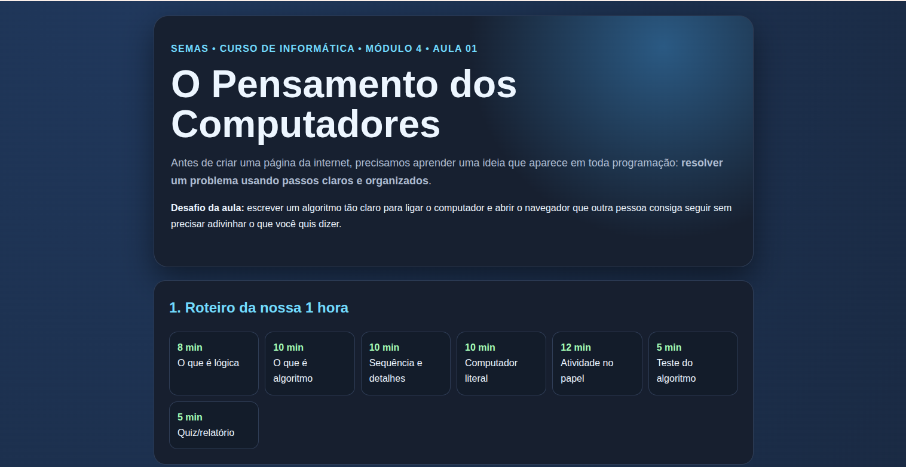
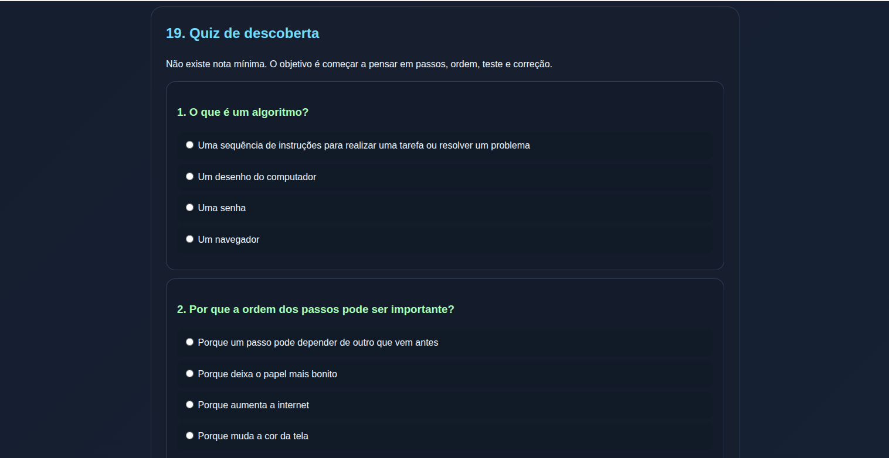
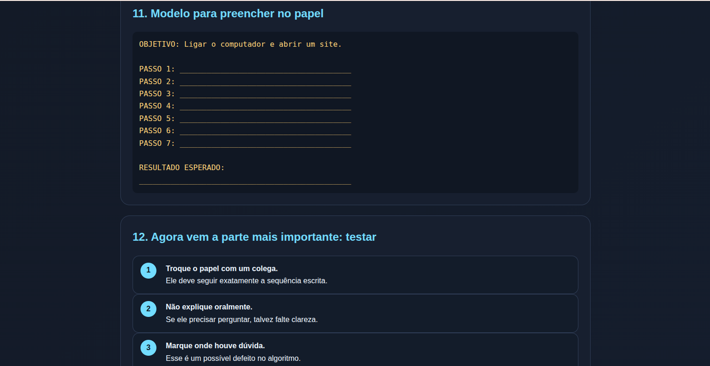

# 💻 Curso de Informática Básica Interativa — SEMAS

Este ambiente de aprendizagem foi desenvolvido especialmente para as turmas de inclusão digital da **Secretaria Municipal de Assistência Social (SEMAS)**. O projeto utiliza tecnologias web estáticas (**HTML5, CSS3 e JavaScript**) para fornecer um material didático leve, acessível e totalmente gratuito para a comunidade.

Eu desenvolvi esse curso com intuito de ser o mais prático e dinâmico possível evitar evasão e dar oportunidade para quem mora longe, em comunidades rurais de difícil acesso.

Bem-vindo(a) ao repositório do **Curso de Informática**! Este projeto foi desenvolvido inteiramente em tecnologias web estáticas (**HTML5, CSS3 e JavaScript**), estruturado para oferecer uma experiência de aprendizado leve, moderna e sem a necessidade de instalações complexas.

---

## 🚀 Como acessar o curso?
O curso está publicado e pronto para uso através do **GitHub Pages**! 
👉 **Clique aqui para acessar as aulas:** [https://mana745.github.io/Curso-de-Informatica/]

---

## 📚 Estrutura do Curso
O conteúdo está dividido de forma lógica em **5 módulos independentes**, contendo **8 aulas cada**, projetados para guiar o estudante desde os fundamentos históricos até os conceitos práticos:

*   **Módulo 0:** [Conceitos de energia,Histórias e introdução]
*   **Módulo 1:** [Práticas de Terminal, Explorer e Internet]
*   **Módulo 2:** [Word, excell, projeto e gestão financeira ]
*   **Módulo 3:** [Conceitos de IA, Inteligência de prompt para IAs]
*   **Módulo 4:** [Conceitos de programação, programação em HTML e Vibe coding ]

---

## 🔄 Ecossistema de Aprendizagem (Como funciona a dinâmica?)

Para o perfeito andamento das aulas e controle pedagógico, o curso utiliza três ferramentas de forma integrada:

1.  **Ambiente de Estudo (GitHub Pages):** Onde o aluno lê os materiais pedagógicos, acessa os links de pesquisa confiáveis (como *Smithsonian* e *Computer History Museum*) e realiza os quizzes interativos.
2.  **Central da Turma (Google Classroom):** Espaço onde o professor publica os cronogramas de estudo, os links de cada módulo e gerencia as entregas.
3.  **Portfólio de Atividades (Google Drive):** Ao finalizar o quiz integrado de cada aula, o aluno gera um relatório local clicando em **"Baixar minha atividade"**. Em seguida, ele faz o upload desse arquivo na plataforma do Classroom/Drive para a correção e acompanhamento do professor.

---

## 🛠️ Tecnologias Utilizadas
*   **HTML5:** Estruturação semântica de todo o conteúdo didático.
*   **CSS3:** Estilização visual responsiva para computadores e celulares.
*   **JavaScript:** Lógica de funcionamento dos quizzes interativos e geração automática do relatório de atividades local.

---
*Material didático desenvolvido para turmas de Informática.* 🖥️
## Licença e finalidade do projeto

Este curso foi desenvolvido originalmente para alunos da SEMAS
e para ampliar o acesso ao ensino de informática na comunidade.

O material pode ser utilizado gratuitamente para fins educacionais,
sociais e comunitários.

Não é permitido transformar este projeto em produto comercial,
curso pago, plataforma paga ou qualquer outra forma de exploração
econômica sem autorização expressa do autor.

Código:
PolyForm Noncommercial License 1.0.0

Conteúdo educacional:
Creative Commons Attribution-NonCommercial-ShareAlike 4.0
(CC BY-NC-SA 4.0)

O descumprimento destes termos viola os direitos autorais e constitui uso não autorizado sujeito às penalidades da lei.

Copyright (c) 2026 SEMAS - Curso de Informática Básica Interativa.

